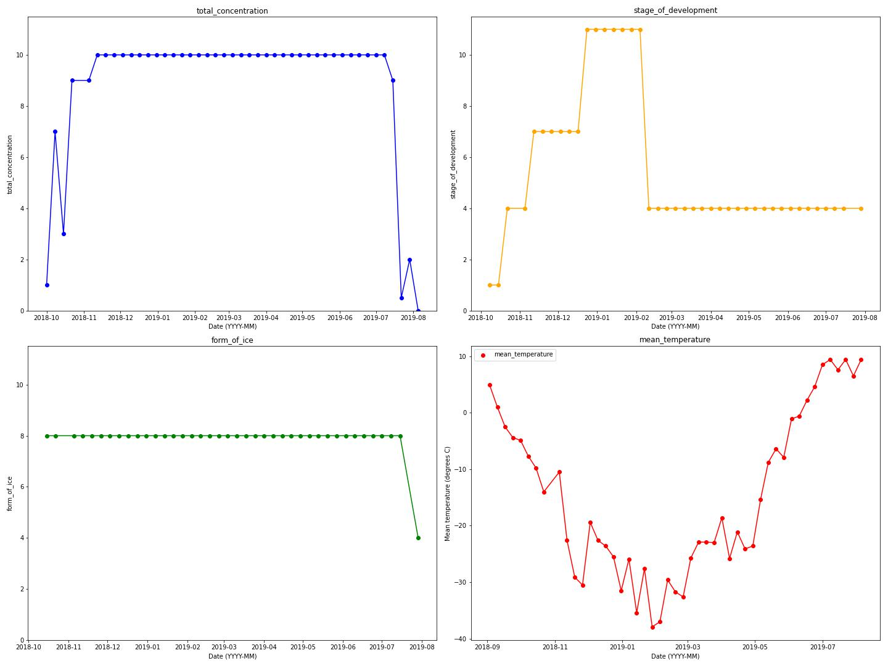
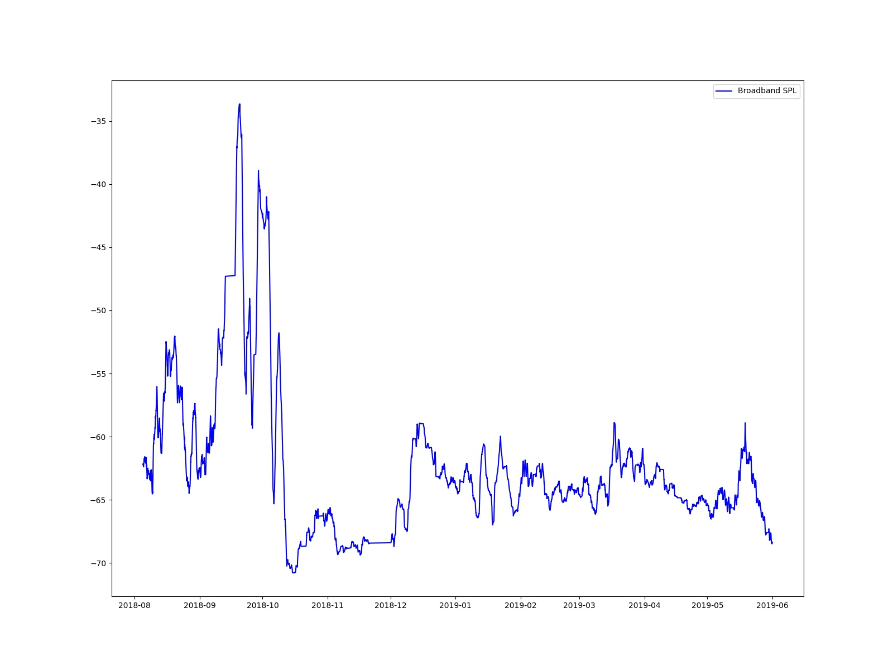
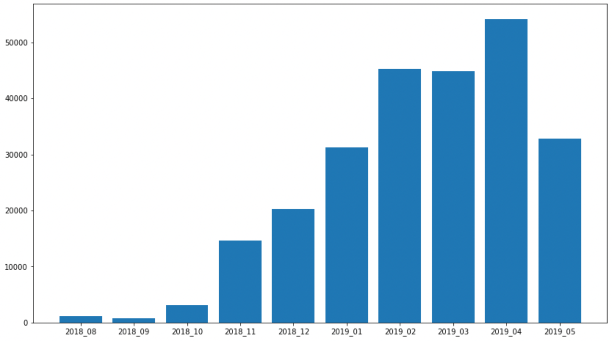

# 06/12/21 Meeting Report

# Ice coverage properties

**Caption**
- Total concentration increased during October and November. Total freeze up lasted from 12/11/2018 - 08/07/2019. 
- The ice was as thick as 'thin first year ice' in 12/11/2018, it thickened to medium first year ice throughout January, before thawing to thin first year ice again. The ice remained in this form in July as it thawed.
- The ice form was land fast all year apart from in August when it was in the form of medium floes.

# Ice coverage properties on one plot

- Temperature has been normalised from -38 - +9 degrees C to 0-10 to compare the change in temperature with the change in ice properties.
- The development of the ice (yellow) correlates with a drop in temperature (red). This trend continues until the coldest temperature is reached at the end of January. 
- As the temperature increases the ice concentration eventually melts but there's a significant time delay.
- The mean temperature is only above freezing in mid June and the ice concentration begins to drop in mid July when the temperature is approximately 8 degrees. The temperature is the mean of the prior 7 days which may explain the delay.

# Whole year SPL

- The above plot is broadband SPL normalised relative to the loudest sound in the year, allowing for a plot of the SPL of the whole year to be made.
- Clearly Augest is quite loud and October is incredibly loud. 
- It's in October that the ice begins to form, with the ice coverage reaching 90% by the end of October, therefore we may be able to attribute this noise to ice processes.

# Transient counts

- 

# Work in progress
- Three groups of transient duratiosn and their frequency over the year (compare between months).
- PCA between these same bins.
The above tasks need me to write some modifed transient grouping code than what I currently have.
